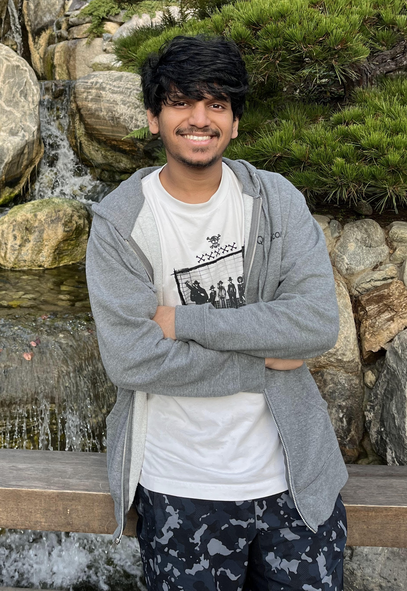
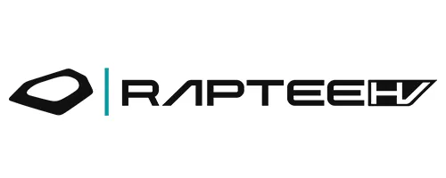
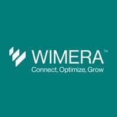

<!doctype html>
<html lang="en">
<head>
  <meta charset="utf-8"/>
  <title>Soumya Ranjan – Firmware & Fun</title>
  <meta name="viewport" content="width=device-width, initial-scale=1"/>
  <link rel="stylesheet" href="https://unpkg.com/leaflet@1.9.4/dist/leaflet.css"/>
  <link href="https://fonts.googleapis.com/css2?family=Inter:wght@400;700&family=Share+Tech+Mono&display=swap" rel="stylesheet">
  
<base target="_blank">
</head>
<body>

<header>
  
  
Soumya Ranjan

  

    ⚙️🖥️🤖🧠✈️⚽🎌🎬📺🎮
  

</header>

  
About

  
Experience

  
Projects

  
Travel

  
Entertainment

<!-- =========================================================
                         ABOUT
============================================================ -->

  <section>
    

      

        Currently working as a Software Engineer on the Bluetooth Firmware team at Qualcomm, I specialize in optimizing software for performance and memory utilization. I hold a Master’s degree in Computer Engineering (Embedded Systems) and a Bachelor’s degree in Electrical and Electronics Engineering.
      

      

        My journey is fueled by a passion for creating innovative solutions and a solid foundation in Low-Level Drivers, Operating Systems, Compilers, Parallel & GPU Programming, Hardware Design, Signal & Image Processing, Machine Learning and IoT.
      

      

        Outside of work you’ll find me scoring goals on the football field, listening to rock music, or competitively gaming. Oh—and I’m a Manchester United fan. <strong>#GGMU</strong>
      

      

        
Technical Skills ▾

        

          <h4>Programming Languages</h4>
          CC++PythonEmbedded CAssemblySystemCBashRustCUDA
          <h4>Software Tools</h4>
          GitAltiumProteusMakeCMakeMATLABSimulinkFreeRTOSTensorFlowPyTorchKeilTrace32OpenBMC
          <h4>Technologies</h4>
          FirmwareRTOSImage ProcessingEmbedded LinuxMachine LearningDeep LearningNetworkingRoboticsPCB DesignCompilers (GCC/Clang/LLVM)ARM / RISC-V / x86
        

      

    

  </section>

<!-- =========================================================
                       EXPERIENCE
============================================================ -->

  <section>
    <h2>Experience</h2>
    

      
      
      
    

    

      <h3>Qualcomm – Software Engineer (Feb 2024 – Present)</h3>
      <ul><li>BT/BLE features 2.4/5 GHz pre- → post-silicon; co-existence BT/Wi-Fi/UWB; chained crash-dump framework.</li></ul>
    

    

      <h3>Qualcomm – Software Engineer Intern (Jun – Sep 2023)</h3>
      <ul><li>Automated OTP macro generation from JSON; IOP/SPI ring-buffer loggers; ELF call-tree generator.</li></ul>
    

    

      <h3>Raptee Motors – Firmware Engineer (Jun – Sep 2022)</h3>
      <ul><li>Cut boot-time 50 % with shared-mem IPC & semaphores; BLE vehicle unlock on BeagleBone-AI SoC; CMake refactor.</li></ul>
    

    

      <h3>Expleo Group – Software Engineer (Oct 2021 – Jun 2022)</h3>
      <ul><li>ECU models in Simulink; CAN→LSTM dataset generator; deployed 80 % acc. anomaly detector (PyTorch) on ECU.</li></ul>
    

    

      <h3>Mistral Solutions – Hardware Intern (Jan – Sep 2021)</h3>
      <ul><li>9 GHz DAC on JESD204B; FMCW radar modules; Sitara AM263x driver bring-up.</li></ul>
    

    

      <h3>Wimera Systems – R&D Intern (May – Jun 2019)</h3>
      <ul><li>Battery-management with charge-pumps; OTA updates on CC3220; RS232 peripheral link.</li></ul>
    

    

      <h3>Bosch – Electrical Maint. Intern (May – Jun 2018)</h3>
      <ul><li>Servo-drive install & PLC/sensor upkeep; machine maintenance.</li></ul>
    

  </section>

<!-- =========================================================
                        PROJECTS
============================================================ -->

  <section>
    <h2>Projects</h2>
    

      <h3>Handy – Smart Glove for Blind People</h3>
      
Camera + GPT-4o obstacle narration, haptic feedback, fall detection, indoor & outdoor navigation.

    

    

      <h3>Smart IoT-based Pollution Monitoring & Purifying System</h3>
      
ESP8266/ESP32 + PMS5003, MQTT over WebSocket, MATLAB Thing-Speak dashboard, auto-triggered purifier.

    

    

      <h3>Battery Cell Voltage Balancing Techniques</h3>
      
Fly-back converter cell balancing (2/4/6-cell) in Simulink for ultra-light EVs.

    

    

      <h3>Human Following Robot</h3>
      
Arduino UNO + IR & Ultrasonic sensors; wooden chassis; servo-driven locomotion.

    

    

      <h3>Intelligent Helmet for Coal Miners</h3>
      
LM35, MQ2, DHT11 → Arduino → Zigbee mesh; real-time enviro-alerts.

    

    

      <h3>Optical Coherence Tomography (OCT) Camera</h3>
      
27 kHz line-scan camera with OpenCV + spectral analysis on FPGA for medical imaging. <a href="https://www.warse.org/IJETER/static/pdf/file/ijeter1308102020.pdf" target="_blank">Paper</a>

    

    

      <h3>Smart Traffic Management with Violation Detection</h3>
      
FPGA-based system + solar battery module; published research.

    

    

      <h3>Drowsiness Detection with CNN</h3>
      
4 K-sample Kaggle dataset; MATLAB CNN; facial-parameter based alert.

    

    

      <h3>Reusable Rocket Landing Control</h3>
      
State-space modelling, Jacobian linearisation, pole-placement controller in MATLAB/Simulink.

    

    

      <h3>Smart Parking System (Android)</h3>
      
GPS + IR vacancy detection; native Android app guides drivers to free slots.

    

    

      <h3>Gyro Stabilization Platform</h3>
      
MPU6050 → Arduino UNO; 3-servo self-balancing platform with closed-loop control.

    

  </section>

<!-- =========================================================
                         TRAVEL
============================================================ -->

  <section>
    <h2>Travel</h2>
    

      
World Map

      
USA

    

    

      

    

    

      

        <h3>States Visited</h3>
        
CA, TX, NY, WA, OR, NV, AZ, UT, CO, IL, FL, MA, VA, MD, PA, NJ, OH, MI, NC, GA …

      

      

        <h3>National Parks</h3>
        
Yosemite, Grand Canyon, Zion, Bryce, Arches, Rocky Mountain, Great Smoky Mountains, Everglades, Joshua Tree, Sequoia …

      

    

  </section>

<!-- =========================================================
                      ENTERTAINMENT
============================================================ -->

  <section>
    <h2>Entertainment</h2>
    

      
Movies

      
Anime

      
TV Shows

      
Gaming

    

    

      
Movie list coming soon …

    

    

      
Anime list coming soon …

    

    

      
TV list coming soon …

    

    

      
Gaming list coming soon …

    

  </section>

<!-- ==================  JS  ================== -->

</body>
</html>
